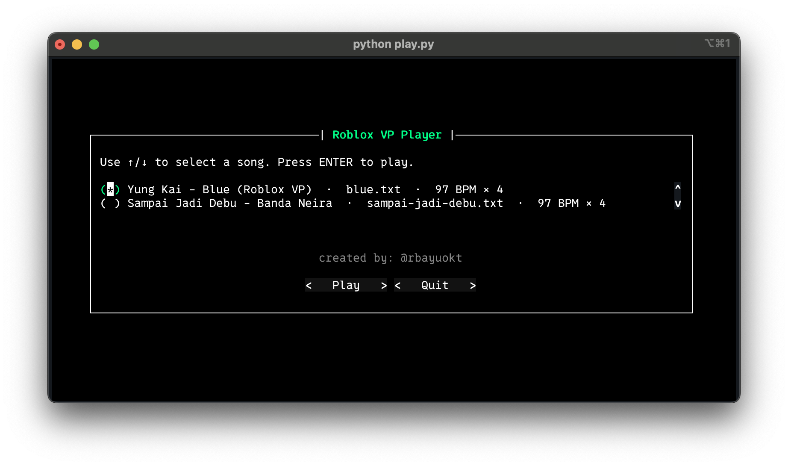
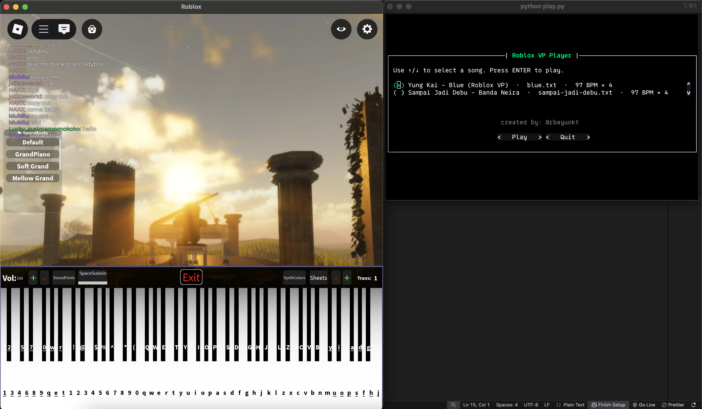
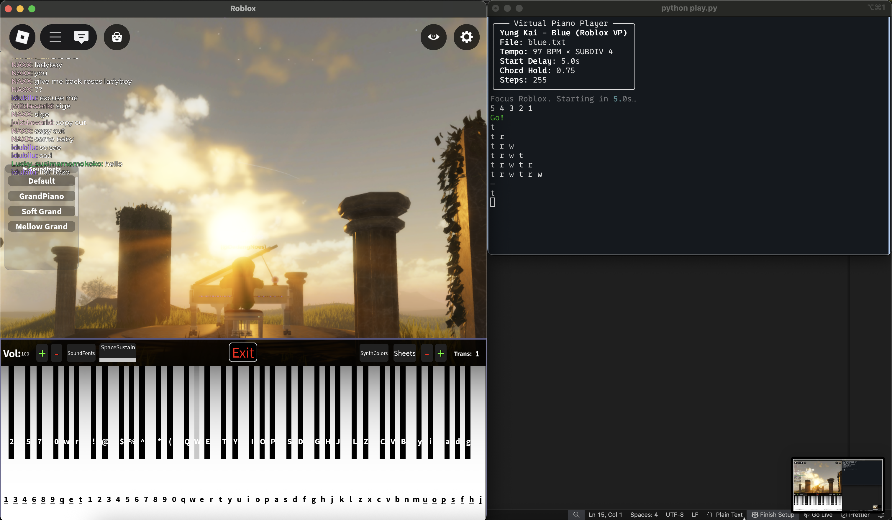

# Roblox Virtual Piano Player

<br/><br/>

A small terminal tool that plays Roblox **Virtual Piano** sheets for you. Drop song files in `sheets/`, pick one with ↑/↓, press Enter, then click the Roblox window during the countdown the app types the notes in time. Each sheet defines its own tempo and playback (BPM, SUBDIV, START_DELAY, CHORD_HOLD, optional PRINT_MODE). Chords like `[ad]` are handled correctly, and the console can show what’s being played as it goes. No hacks or memory tricks just clean, timed keystrokes you could play yourself.

**Map name** :
(Relapse) Are you lonely

## Features
- Per-song settings in the sheet header (TITLE, BPM, SUBDIV, START_DELAY, CHORD_HOLD, optional PRINT_MODE)
- Arrow-key picker with Enter to play
- Stable print modes: paired, current, cumulative, both, off
- Drift-corrected timing

## Screenshots

<br/><br/>

<br/><br/>

<br/><br/>

## Install
```bash
python -m venv .venv
source .venv/bin/activate
pip install -r requirements.txt
```

**macOS**: allow Accessibility + Input Monitoring for your terminal.

## Run
```bash
python play.py
```
- Use ↑/↓ to select a song and press Enter.
- Immediately **click/focus** the **Roblox window** during the countdown (START_DELAY) so keystrokes go to Roblox.

## Sheets
Each song lives in a `.txt` or `.vps` file inside `sheets/`, with a header of `KEY=VALUE` lines followed by a blank line and then the notes:

```bash
TITLE=My Song
BPM=97
SUBDIV=4
START_DELAY=5.0
CHORD_HOLD=0.75
PRINT_MODE=cumulative

t r w
[ad] t r
```

### Rests (new!)
Use `.` to insert silent time between notes—just like musical rests.

```bash
- Each `.` = 1 subdivision step of silence.
- Runs add up: `...` = 3 steps, `......` = 6 steps.
- Printed as `·` in the console so you can see the timing.

Cheat sheet:
- With `SUBDIV=4` (sixteenths):  
  `.` = 1/16, `..` = 1/8, `....` = 1/4, `........` = 1/2, `................` = 1 bar (4/4).
- With `SUBDIV=2` (eighths):  
  `.` = 1/8, `..` = 1/4, `....` = 1/2, `........` = 1 bar (4/4).

```
Examples:
**SUBDIV=4**
```bash
t .. r # 1/8 rest between t and r
[ad] .... g # 1/4 rest before g
y ...... [tu] # 3/8 rest, then a chord
```


Information:

```
Header fields (what they mean)

TITLE — The display name shown in the picker and preview panel.

BPM — Tempo in beats per minute (integer, e.g. 97). Higher = faster.

SUBDIV — How many tokens per beat.
- 1 = quarter-notes
- 2 = eighths
- 4 = sixteenths (faster feel)
Each token (letter or chord like [ad]) advances one subdivision step.

START_DELAY — Seconds to wait before starting playback (countdown), so you can click/focus the Roblox window.

CHORD_HOLD — How long to hold keys within each step, as a fraction from 0.0 to 1.0.
- Typical: 0.70–0.95
- Example: with step = 0.15s and CHORD_HOLD=0.75, keys are held ~0.1125s, then released before the next token.

PRINT_MODE (optional) — How the terminal prints tokens:
- paired → current token, then the cumulative line
- current → only current token
- cumulative → only the cumulative line (default in app)
- both → current token, then global cumulative (no line reset)
- off → no printing
```

## License
MIT

## Credits
created by **@rbayuokt**, made with ❤️ and 🎵